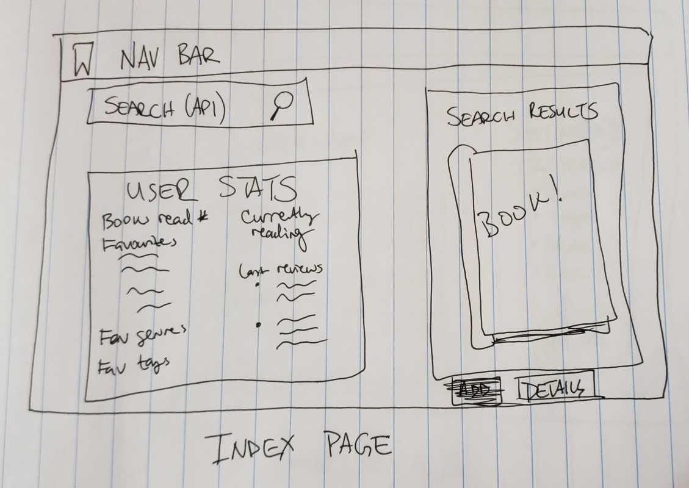
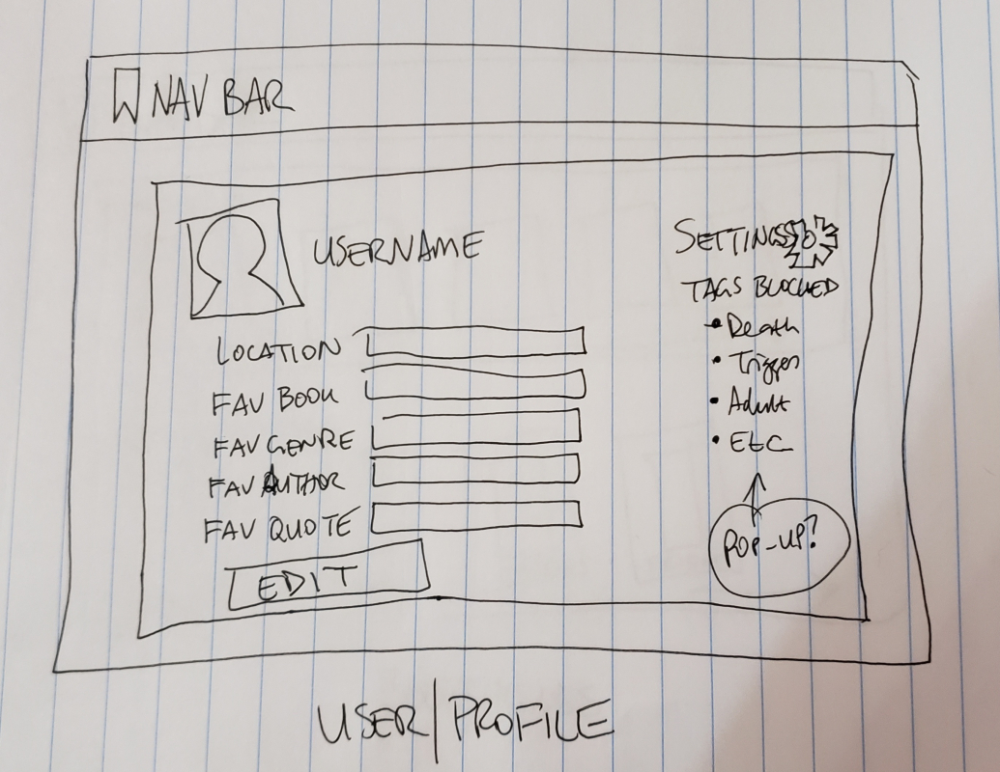
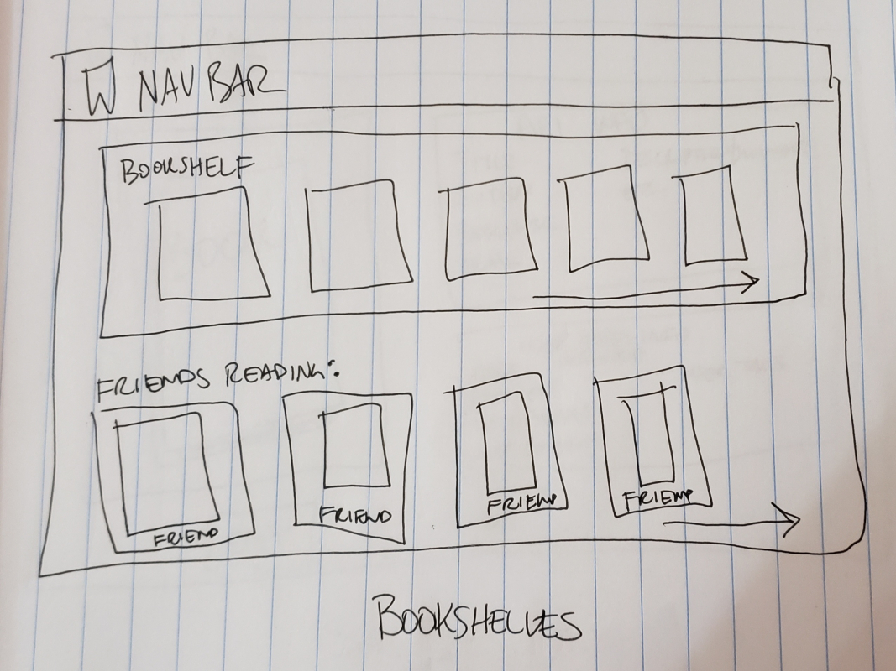
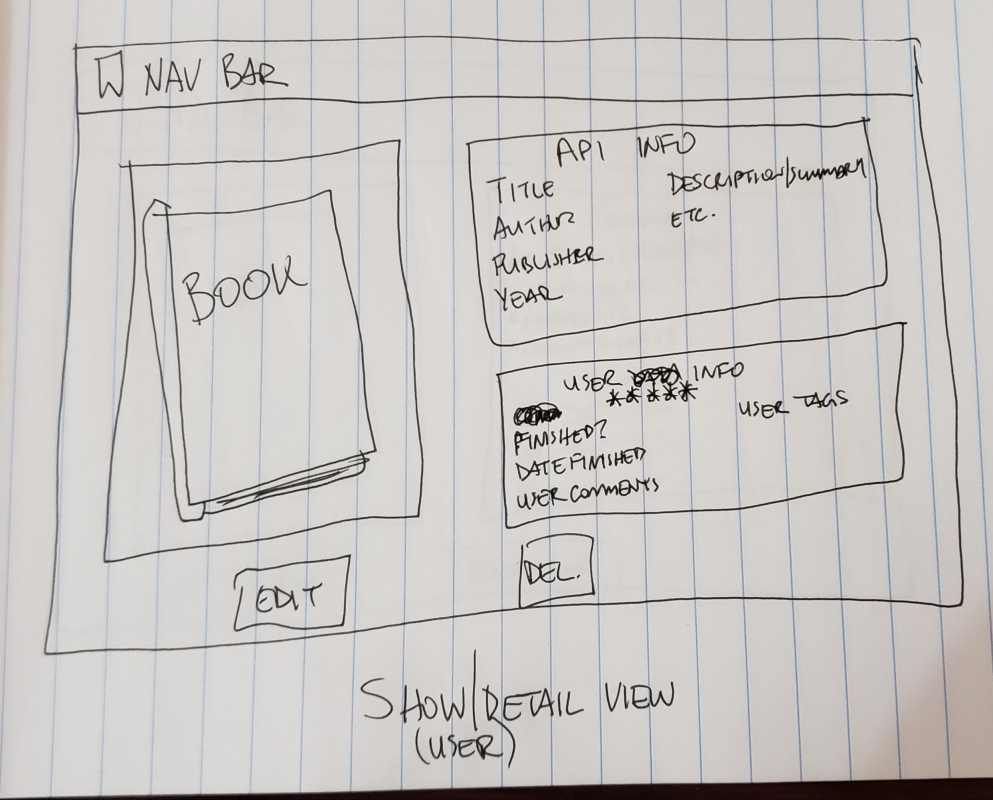
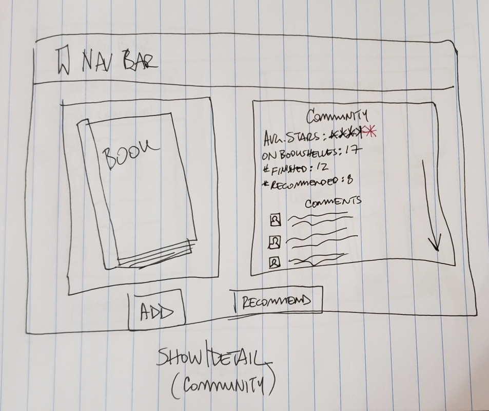
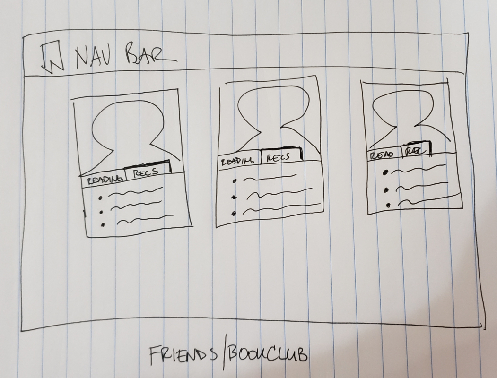
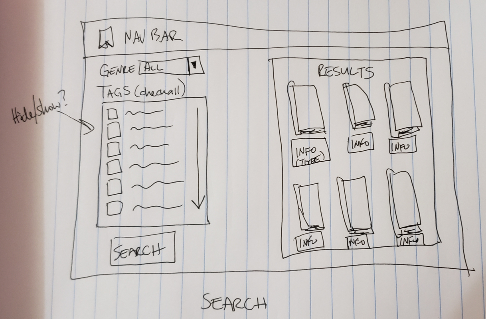
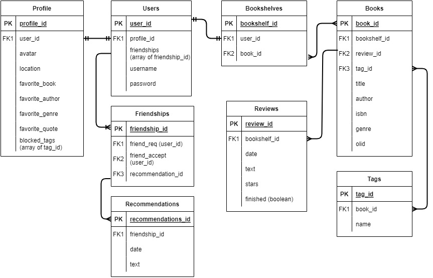

# Bookmark
An app for readers to log their books read, comment on those books, recommend to friends, and receive recommendations on what to read next.

---

## Built With

* Mongoose
* MongoDB
* Express
* Node.js
* Axios

---

## User Story
The user will be able to:
* Log in and view and edit their profile and preferences
* See a summary of their interactions with the site (books read, currently reading, favorite genres, etc.)
* Contribute to the site's library of books
* Search that library for books to add to their bookshelf
* See their friends' books including what they're currently reading
* Rate books and leave reviews
* Recommend books to friends and receive recommendations

---

## Installation Instructions
* Fork and clone this repository
* Run ```npm install``` to install required packages
* To populate with book seed data enter ```npm run seed``` at the command line for the cloned repository
* Enter ```npm start``` to launch the API server locally
* Visit [bookmark-client](https://github.com/NikPurvis/bookmark-client) for Bookmark's frontend
---

## Wireframes








---

## ERD



---

## Route Tables

### User Authentication
| Method        | Endpoint      | Function          |
|---------------|---------------|-------------------|
| POST          | /sign-up      | User creation     |
| POST          | /sign-in      | User login        |
| PATCH         | /change-password  | Change password   |
| DELETE        | /sign-out     | User logout       |

### Books
| Method        | Endpoint      | Function          |
|---------------|---------------|-------------------|
| GET           | /books        | Show all books    |
| GET           | /books/:id    | Show specific book |
| POST          | /books        | Create a new book |
| PATCH         | /books/:id    | Update a book     | 
| DELETE        | /books/:id    | Delete a book     |

### Profile
| Method        | Endpoint      | Function          |
|---------------|---------------|-------------------|
| GET           | /profile/:userId | Get a user's profile |
| PATCH         | /profile/:userId | Update user's profile |

### Reviews
| Method        | Endpoint      | Function          |
|---------------|---------------|-------------------|
| GET           | /reviews/:bookId | Get all reviews for a book |
| POST          | /reviews/:bookId | Post a new book review |
| DELETE (bug)       | /reviews/:bookId/:reviewId | Delete a review |


### Routes To Be Added
Friends, Bookshelf, Tags

---

